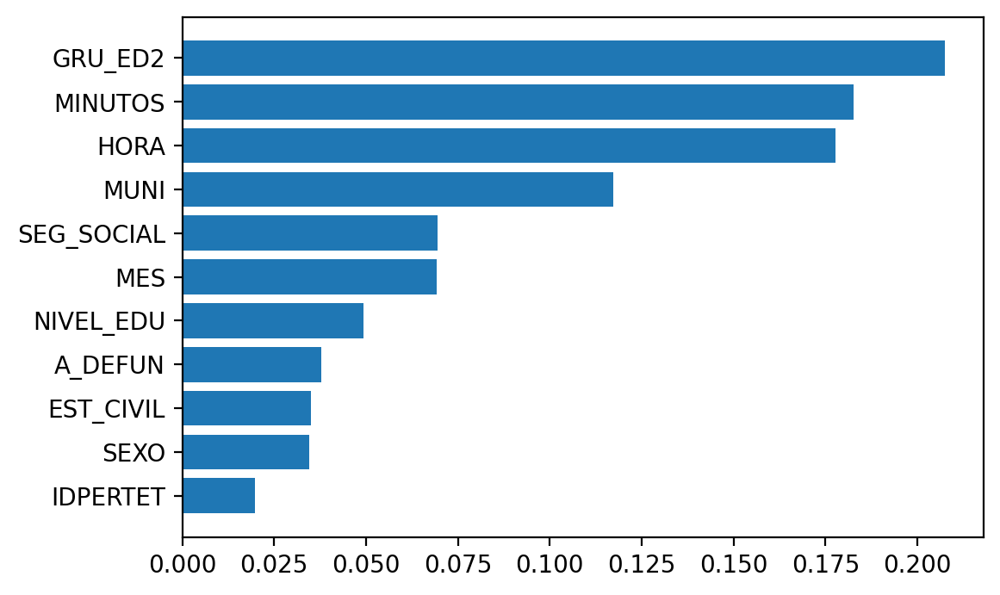
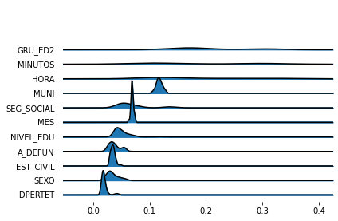
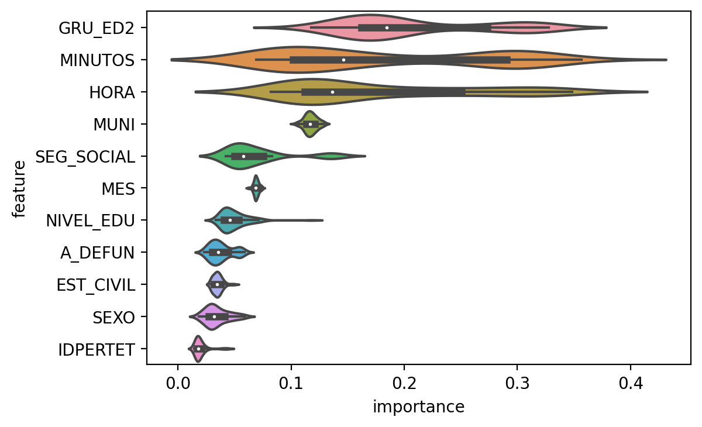

In the previous post I ended up with a naive model and explored the performance
metrics available in `scikit-learn`. Now let's move on to exploring how to
assess feature importance.

But first let me fit again the naive model to work with.


```python
deaths_2016 = pd.read_csv(
    "../../Python/deaths_eevv/data_src/Nofetal_2016.txt",
    sep="\t", encoding="WINDOWS-1252"
)

deaths_2016["MUNI"] = deaths_2016["COD_DPTO"]*1000 + deaths_2016["COD_MUNIC"]
deaths_2016 = deaths_2016.loc[deaths_2016["PMAN_MUER"] != 3]
deaths_2016 = deaths_2016[[
    "PMAN_MUER", "MES", "HORA", "MINUTOS", "SEXO", "EST_CIVIL", "GRU_ED2",
    "NIVEL_EDU", "IDPERTET", "SEG_SOCIAL", "MUNI", "A_DEFUN"
]]
deaths_2016 = deaths_2016.dropna()

X_all = deaths_2016.drop("PMAN_MUER", "columns")
y_all = deaths_2016.loc[:, "PMAN_MUER"]
from sklearn.model_selection import train_test_split
X_train, X_test, y_train, y_test = train_test_split(
    X_all, y_all, test_size=0.3, random_state=0
)
from sklearn.ensemble import RandomForestClassifier
rforestclf = RandomForestClassifier(n_estimators=100, n_jobs=-1, random_state=0)
with TicToc(): # TicToc just to time it
    rforestclf.fit(X_train, y_train)
with TicToc(): # TicToc just to time it
    y_pred = rforestclf.predict(X_test)
with TicToc(): # TicToc just to time it
    y_prob = rforestclf.predict_proba(X_test)
```


Elapsed time is 9.184644 seconds.
Elapsed time is 0.629486 seconds.
Elapsed time is 0.662780 seconds.


# Feature importance

If you look at how to get feature importance from a Random Forest Classifier
using scikit learn, the simplest way you find is probably this (and probably
the first one you find):


```python
list(zip(X_train, rforestclf.feature_importances_))
```

```
[('MES', 0.06911498633512159),
 ('HORA', 0.17768605045599462),
 ('MINUTOS', 0.18260674193071805),
 ('SEXO', 0.03443579171156089),
 ('EST_CIVIL', 0.03496689065798194),
 ('GRU_ED2', 0.2075589984707883),
 ('NIVEL_EDU', 0.04939604073736049),
 ('IDPERTET', 0.019784497814925785),
 ('SEG_SOCIAL', 0.06939200067145147),
 ('MUNI', 0.11717053097885965),
 ('A_DEFUN', 0.03788747023523727)]
```


Ok, that works. But ...

- it is ugly
- not sorted (although you can fix that with one line)
- does not show how feature importance varies in the forest

So let's try a simple plot using `matplotlib`, adapting [Chris Albon's code
here](https://chrisalbon.com/machine_learning/trees_and_forests/feature_importance/)


```python
import numpy as np
# need to sort the features by importance and get the names of the features
indices = np.argsort(rforestclf.feature_importances_)[::1]
names = [X_train.columns[i] for i in indices]
import matplotlib.pyplot as plt
plt.figure()
plt.barh(range(X_train.shape[1]), rforestclf.feature_importances_[indices])
plt.yticks(range(X_train.shape[1]), names)
plt.show()
```

\


Ok, that's better. I just keep missing taking a look at the variability in the
forest. `scikit-learn` has [this example](https://scikit-learn.org/stable/auto_examples/ensemble/plot_forest_importances.html),
where they plot feature importance in a bar plot and add inter-tree variability
as error bars/lines. So let's take that as an inspiration and see what I come
up with. Basically I do not like these bar plots topped with error lines, so
I will try something different.

First, a joy plot


```python
indices = np.argsort(rforestclf.feature_importances_)[::-1]
names = [X_train.columns[i] for i in indices]

import joypy
importance_variability = [tree.feature_importances_ for tree in rforestclf.estimators_]
importance_variability = pd.DataFrame(np.stack(importance_variability))
importance_variability = importance_variability[indices]
importance_variability.columns = names
%matplotlib inline
fig, axes = joypy.joyplot(importance_variability)
```

\

Ok, now you have a sense of feature importance variability in the forest.
But it seems a lot for the most important variables (which is expected, see
Robin Genuer, Jean-Michel Poggi, Christine Tuleau-Malot. Variable selection
using Random Forests. Pattern Recognition Letters, Elsevier, 2010, 31 (14),
pp.2225-2236. ffhal-00755489f). However, there might also be some over-smoothing
in this kernel density estimate. So let's see also a box plot and perhaps a
violin plot.


```python
import seaborn as sns
importance_variability = importance_variability.melt(var_name='feature',
                                                     value_name='importance')
ax = sns.violinplot(x="importance", y="feature", data=importance_variability,
                    scale="width")
```

\

Yeah, I think this more accurately reflects what is going on.


```python
row_p = pd.crosstab(y_test, X_test["SEXO"], margins=True, normalize="index")
col_p = pd.crosstab(y_test, X_test["SEXO"], margins=True, normalize="columns")
men_violent_rowp = "{0:.1%}".format(row_p[1][2])
wom_violent_rowp = "{0:.1%}".format(row_p[2][2])
men_violent_colp = "{0:.1%}".format(col_p[1][2])
wom_violent_colp = "{0:.1%}".format(col_p[2][2])
```


Yet, there is something odd with these feature importances. It does not seem
correct that sex has such a low importance in predicting whether it was a
volent death. Indeed, if you look at the raw numbers, being men or women seems
pretty important. Although overall men die slightly more than women, they are
certainly over-represented in the violent deaths. Among all violent deaths, men
account for '84.3%' and women only '15.6%'.
Similarly, among all dead men, '19.4%' died violently while
only '4.4%' of the women had a violent death. Here the tables:


```python
pd.crosstab(y_test, X_test["SEXO"], margins=True)
```

```
SEXO           1      2  3    All
PMAN_MUER
1          29623  28402  0  58025
2           7115   1318  3   8436
All        36738  29720  3  66461
```


```python
pd.crosstab(y_test, X_test["SEXO"], margins=True, normalize="index")
```

```
SEXO              1         2         3
PMAN_MUER
1          0.510521  0.489479  0.000000
2          0.843409  0.156235  0.000356
All        0.552775  0.447180  0.000045
```


```python
pd.crosstab(y_test, X_test["SEXO"], margins=True, normalize="columns")
```

```
SEXO              1         2    3       All
PMAN_MUER
1          0.806331  0.955653  0.0  0.873068
2          0.193669  0.044347  1.0  0.126932
```


Now, why sex appears to have such a low importance in the model?

The answer is most probably because a well-known issue in this way of measuring
feature importance. So far I used scikit-learn's `feature_importances_`,
that in this case correspond to an average of the importances in each tree in
the forest, which are ["computed as the (normalized) total reduction of the
criterion brought by that feature. It is also known as the Gini importance."](https://scikit-learn.org/stable/modules/generated/sklearn.tree.DecisionTreeClassifier.html).
This is also known as mean decrease in impurity.
Unfortunately, this measure has been shown to be ["affected by the number of
categories and scale of measurement of the predictor variables, which are no
direct indicators of the true importance of the variable"](https://link.springer.com/article/10.1186/1471-2105-8-25),
so variables with many categories will have artificially higher importance than
low cardinality variables. And this could well be the case here. Sex has only
three possible values (man, woman, unknown), while other features like
municipality may have over a thousand unique values.

Another issue with this method is correlated predictors. It would tend
to highlight one of the predictors with high importance, leaving the other one
with low importance (intuitively because after one predictor has been used,
the other one has only residual predictive power).

An alternative that does not have such issues is permutation importance a.k.a
mean decrease accuracy. The idea is that you randomly shuffle one predictor
at a time, and observe how much decreases the model accuracy in each tree,
and average over all the forest (hence, mean decrease accuracy).

It seems scikit-learn does not provide any function to calculate permutation
importance. But there are a number of options out there. **EDIT: July 2019,
apparently now `scikit-learn` will also provide methods to calculate
permutation importance. At least they have [merged](https://github.com/scikit-learn/scikit-learn/pull/13146/files)
that into the master repository. I haven't tried it yet, though**

`eli5` library provides permutation importance methods for scikit-learn
estimators. It's straightforward: one-liner and you get the permutation
importance. Also, it's cool you can tell the library which scoring measure
to use. In this case it would be important due to the imbalance problem we saw
earlier. The default scoring measure is accuracy and we already checked that it
could be overly optimistic. Hence, it could also be misleading in the case of
feature importance. Let's obtain feature importances based on several
scoring measures.


```python
import eli5
from eli5.sklearn import PermutationImportance

# sorted(metrics.SCORERS.keys())
with TicToc(): # TicToc just to time it
    perm1 = PermutationImportance(
        estimator=rforestclf, scoring="accuracy", n_iter=5, random_state=0
    ).fit(X_test, y_test)
with TicToc(): # TicToc just to time it
    perm2 = PermutationImportance(
        estimator=rforestclf, scoring="balanced_accuracy", n_iter=5, random_state=0
    ).fit(X_test, y_test)
with TicToc(): # TicToc just to time it
    perm3 = PermutationImportance(
        estimator=rforestclf, scoring="jaccard_weighted", n_iter=5, random_state=0
    ).fit(X_test, y_test)
with TicToc(): # TicToc just to time it
    perm4 = PermutationImportance(
        estimator=rforestclf, scoring="roc_auc", n_iter=5, random_state=0
    ).fit(X_test, y_test)
with TicToc(): # TicToc just to time it
    perm5 = PermutationImportance(
        estimator=rforestclf, scoring="recall", n_iter=5, random_state=0
    ).fit(X_test, y_test)
```

```
Elapsed time is 37.723501 seconds.
Elapsed time is 40.922779 seconds.
Elapsed time is 37.949079 seconds.
Elapsed time is 37.144632 seconds.
Elapsed time is 38.547389 seconds.
```


`eli5` provides a visualization method, to display a colored table.

```python
perm1_html = eli5.show_weights(perm1, feature_names = X_train.columns.tolist())
perm2_html = eli5.show_weights(perm2, feature_names = X_train.columns.tolist())
perm3_html = eli5.show_weights(perm3, feature_names = X_train.columns.tolist())
perm4_html = eli5.show_weights(perm4, feature_names = X_train.columns.tolist())
perm5_html = eli5.show_weights(perm5, feature_names = X_train.columns.tolist())
```


```python
display_markdown(perm1_html.data, raw=True)
display_markdown(perm2_html.data, raw=True)
display_markdown(perm3_html.data, raw=True)
display_markdown(perm4_html.data, raw=True)
display_markdown(perm5_html.data, raw=True)
```


    <style>
    table.eli5-weights tr:hover {
        filter: brightness(85%);
    }
</style>


    

    

    

    

    

    


    

    

    

    

    

    


    

    

    

    

    
        <table class="eli5-weights eli5-feature-importances" style="border-collapse: collapse; border: none; margin-top: 0em; table-layout: auto;">
    <thead>
    <tr style="border: none;">
        <th style="padding: 0 1em 0 0.5em; text-align: right; border: none;">Weight</th>
        <th style="padding: 0 0.5em 0 0.5em; text-align: left; border: none;">Feature</th>
    </tr>
    </thead>
    <tbody>
    
        <tr style="background-color: hsl(120, 100.00%, 80.00%); border: none;">
            <td style="padding: 0 1em 0 0.5em; text-align: right; border: none;">
                0.0354
                
                    &plusmn; 0.0012
                
            </td>
            <td style="padding: 0 0.5em 0 0.5em; text-align: left; border: none;">
                GRU_ED2
            </td>
        </tr>
    
        <tr style="background-color: hsl(120, 100.00%, 80.27%); border: none;">
            <td style="padding: 0 1em 0 0.5em; text-align: right; border: none;">
                0.0347
                
                    &plusmn; 0.0011
                
            </td>
            <td style="padding: 0 0.5em 0 0.5em; text-align: left; border: none;">
                MINUTOS
            </td>
        </tr>
    
        <tr style="background-color: hsl(120, 100.00%, 89.50%); border: none;">
            <td style="padding: 0 1em 0 0.5em; text-align: right; border: none;">
                0.0141
                
                    &plusmn; 0.0010
                
            </td>
            <td style="padding: 0 0.5em 0 0.5em; text-align: left; border: none;">
                SEG_SOCIAL
            </td>
        </tr>
    
        <tr style="background-color: hsl(120, 100.00%, 90.46%); border: none;">
            <td style="padding: 0 1em 0 0.5em; text-align: right; border: none;">
                0.0123
                
                    &plusmn; 0.0005
                
            </td>
            <td style="padding: 0 0.5em 0 0.5em; text-align: left; border: none;">
                HORA
            </td>
        </tr>
    
        <tr style="background-color: hsl(120, 100.00%, 92.47%); border: none;">
            <td style="padding: 0 1em 0 0.5em; text-align: right; border: none;">
                0.0088
                
                    &plusmn; 0.0006
                
            </td>
            <td style="padding: 0 0.5em 0 0.5em; text-align: left; border: none;">
                SEXO
            </td>
        </tr>
    
        <tr style="background-color: hsl(120, 100.00%, 93.53%); border: none;">
            <td style="padding: 0 1em 0 0.5em; text-align: right; border: none;">
                0.0071
                
                    &plusmn; 0.0003
                
            </td>
            <td style="padding: 0 0.5em 0 0.5em; text-align: left; border: none;">
                A_DEFUN
            </td>
        </tr>
    
        <tr style="background-color: hsl(120, 100.00%, 93.85%); border: none;">
            <td style="padding: 0 1em 0 0.5em; text-align: right; border: none;">
                0.0066
                
                    &plusmn; 0.0007
                
            </td>
            <td style="padding: 0 0.5em 0 0.5em; text-align: left; border: none;">
                MUNI
            </td>
        </tr>
    
        <tr style="background-color: hsl(120, 100.00%, 94.29%); border: none;">
            <td style="padding: 0 1em 0 0.5em; text-align: right; border: none;">
                0.0059
                
                    &plusmn; 0.0007
                
            </td>
            <td style="padding: 0 0.5em 0 0.5em; text-align: left; border: none;">
                NIVEL_EDU
            </td>
        </tr>
    
        <tr style="background-color: hsl(120, 100.00%, 95.21%); border: none;">
            <td style="padding: 0 1em 0 0.5em; text-align: right; border: none;">
                0.0046
                
                    &plusmn; 0.0002
                
            </td>
            <td style="padding: 0 0.5em 0 0.5em; text-align: left; border: none;">
                IDPERTET
            </td>
        </tr>
    
        <tr style="background-color: hsl(120, 100.00%, 97.57%); border: none;">
            <td style="padding: 0 1em 0 0.5em; text-align: right; border: none;">
                0.0017
                
                    &plusmn; 0.0004
                
            </td>
            <td style="padding: 0 0.5em 0 0.5em; text-align: left; border: none;">
                EST_CIVIL
            </td>
        </tr>
    
        <tr style="background-color: hsl(120, 100.00%, 99.21%); border: none;">
            <td style="padding: 0 1em 0 0.5em; text-align: right; border: none;">
                0.0003
                
                    &plusmn; 0.0009
                
            </td>
            <td style="padding: 0 0.5em 0 0.5em; text-align: left; border: none;">
                MES
            </td>
        </tr>
    
    
    </tbody>
</table>
    

    


    

    

    

    

    

    


    <style>
    table.eli5-weights tr:hover {
        filter: brightness(85%);
    }
</style>


    

    

    

    

    

    


    

    

    

    

    

    


    

    

    

    

    
        <table class="eli5-weights eli5-feature-importances" style="border-collapse: collapse; border: none; margin-top: 0em; table-layout: auto;">
    <thead>
    <tr style="border: none;">
        <th style="padding: 0 1em 0 0.5em; text-align: right; border: none;">Weight</th>
        <th style="padding: 0 0.5em 0 0.5em; text-align: left; border: none;">Feature</th>
    </tr>
    </thead>
    <tbody>
    
        <tr style="background-color: hsl(120, 100.00%, 80.00%); border: none;">
            <td style="padding: 0 1em 0 0.5em; text-align: right; border: none;">
                0.1201
                
                    &plusmn; 0.0024
                
            </td>
            <td style="padding: 0 0.5em 0 0.5em; text-align: left; border: none;">
                GRU_ED2
            </td>
        </tr>
    
        <tr style="background-color: hsl(120, 100.00%, 91.61%); border: none;">
            <td style="padding: 0 1em 0 0.5em; text-align: right; border: none;">
                0.0347
                
                    &plusmn; 0.0024
                
            </td>
            <td style="padding: 0 0.5em 0 0.5em; text-align: left; border: none;">
                SEXO
            </td>
        </tr>
    
        <tr style="background-color: hsl(120, 100.00%, 92.34%); border: none;">
            <td style="padding: 0 1em 0 0.5em; text-align: right; border: none;">
                0.0305
                
                    &plusmn; 0.0020
                
            </td>
            <td style="padding: 0 0.5em 0 0.5em; text-align: left; border: none;">
                MINUTOS
            </td>
        </tr>
    
        <tr style="background-color: hsl(120, 100.00%, 92.66%); border: none;">
            <td style="padding: 0 1em 0 0.5em; text-align: right; border: none;">
                0.0287
                
                    &plusmn; 0.0011
                
            </td>
            <td style="padding: 0 0.5em 0 0.5em; text-align: left; border: none;">
                SEG_SOCIAL
            </td>
        </tr>
    
        <tr style="background-color: hsl(120, 100.00%, 93.33%); border: none;">
            <td style="padding: 0 1em 0 0.5em; text-align: right; border: none;">
                0.0250
                
                    &plusmn; 0.0016
                
            </td>
            <td style="padding: 0 0.5em 0 0.5em; text-align: left; border: none;">
                MUNI
            </td>
        </tr>
    
        <tr style="background-color: hsl(120, 100.00%, 93.68%); border: none;">
            <td style="padding: 0 1em 0 0.5em; text-align: right; border: none;">
                0.0232
                
                    &plusmn; 0.0015
                
            </td>
            <td style="padding: 0 0.5em 0 0.5em; text-align: left; border: none;">
                NIVEL_EDU
            </td>
        </tr>
    
        <tr style="background-color: hsl(120, 100.00%, 94.80%); border: none;">
            <td style="padding: 0 1em 0 0.5em; text-align: right; border: none;">
                0.0175
                
                    &plusmn; 0.0009
                
            </td>
            <td style="padding: 0 0.5em 0 0.5em; text-align: left; border: none;">
                A_DEFUN
            </td>
        </tr>
    
        <tr style="background-color: hsl(120, 100.00%, 95.48%); border: none;">
            <td style="padding: 0 1em 0 0.5em; text-align: right; border: none;">
                0.0143
                
                    &plusmn; 0.0020
                
            </td>
            <td style="padding: 0 0.5em 0 0.5em; text-align: left; border: none;">
                HORA
            </td>
        </tr>
    
        <tr style="background-color: hsl(120, 100.00%, 96.15%); border: none;">
            <td style="padding: 0 1em 0 0.5em; text-align: right; border: none;">
                0.0114
                
                    &plusmn; 0.0013
                
            </td>
            <td style="padding: 0 0.5em 0 0.5em; text-align: left; border: none;">
                EST_CIVIL
            </td>
        </tr>
    
        <tr style="background-color: hsl(120, 100.00%, 97.29%); border: none;">
            <td style="padding: 0 1em 0 0.5em; text-align: right; border: none;">
                0.0069
                
                    &plusmn; 0.0007
                
            </td>
            <td style="padding: 0 0.5em 0 0.5em; text-align: left; border: none;">
                IDPERTET
            </td>
        </tr>
    
        <tr style="background-color: hsl(120, 100.00%, 99.06%); border: none;">
            <td style="padding: 0 1em 0 0.5em; text-align: right; border: none;">
                0.0015
                
                    &plusmn; 0.0017
                
            </td>
            <td style="padding: 0 0.5em 0 0.5em; text-align: left; border: none;">
                MES
            </td>
        </tr>
    
    
    </tbody>
</table>
    

    


    

    

    

    

    

    


    <style>
    table.eli5-weights tr:hover {
        filter: brightness(85%);
    }
</style>


    

    

    

    

    

    


    

    

    

    

    

    


    

    

    

    

    
        <table class="eli5-weights eli5-feature-importances" style="border-collapse: collapse; border: none; margin-top: 0em; table-layout: auto;">
    <thead>
    <tr style="border: none;">
        <th style="padding: 0 1em 0 0.5em; text-align: right; border: none;">Weight</th>
        <th style="padding: 0 0.5em 0 0.5em; text-align: left; border: none;">Feature</th>
    </tr>
    </thead>
    <tbody>
    
        <tr style="background-color: hsl(120, 100.00%, 80.00%); border: none;">
            <td style="padding: 0 1em 0 0.5em; text-align: right; border: none;">
                0.0591
                
                    &plusmn; 0.0016
                
            </td>
            <td style="padding: 0 0.5em 0 0.5em; text-align: left; border: none;">
                GRU_ED2
            </td>
        </tr>
    
        <tr style="background-color: hsl(120, 100.00%, 82.53%); border: none;">
            <td style="padding: 0 1em 0 0.5em; text-align: right; border: none;">
                0.0488
                
                    &plusmn; 0.0016
                
            </td>
            <td style="padding: 0 0.5em 0 0.5em; text-align: left; border: none;">
                MINUTOS
            </td>
        </tr>
    
        <tr style="background-color: hsl(120, 100.00%, 89.95%); border: none;">
            <td style="padding: 0 1em 0 0.5em; text-align: right; border: none;">
                0.0221
                
                    &plusmn; 0.0014
                
            </td>
            <td style="padding: 0 0.5em 0 0.5em; text-align: left; border: none;">
                SEG_SOCIAL
            </td>
        </tr>
    
        <tr style="background-color: hsl(120, 100.00%, 91.18%); border: none;">
            <td style="padding: 0 1em 0 0.5em; text-align: right; border: none;">
                0.0184
                
                    &plusmn; 0.0008
                
            </td>
            <td style="padding: 0 0.5em 0 0.5em; text-align: left; border: none;">
                HORA
            </td>
        </tr>
    
        <tr style="background-color: hsl(120, 100.00%, 92.15%); border: none;">
            <td style="padding: 0 1em 0 0.5em; text-align: right; border: none;">
                0.0155
                
                    &plusmn; 0.0010
                
            </td>
            <td style="padding: 0 0.5em 0 0.5em; text-align: left; border: none;">
                SEXO
            </td>
        </tr>
    
        <tr style="background-color: hsl(120, 100.00%, 93.62%); border: none;">
            <td style="padding: 0 1em 0 0.5em; text-align: right; border: none;">
                0.0116
                
                    &plusmn; 0.0010
                
            </td>
            <td style="padding: 0 0.5em 0 0.5em; text-align: left; border: none;">
                MUNI
            </td>
        </tr>
    
        <tr style="background-color: hsl(120, 100.00%, 93.63%); border: none;">
            <td style="padding: 0 1em 0 0.5em; text-align: right; border: none;">
                0.0115
                
                    &plusmn; 0.0005
                
            </td>
            <td style="padding: 0 0.5em 0 0.5em; text-align: left; border: none;">
                A_DEFUN
            </td>
        </tr>
    
        <tr style="background-color: hsl(120, 100.00%, 94.05%); border: none;">
            <td style="padding: 0 1em 0 0.5em; text-align: right; border: none;">
                0.0105
                
                    &plusmn; 0.0011
                
            </td>
            <td style="padding: 0 0.5em 0 0.5em; text-align: left; border: none;">
                NIVEL_EDU
            </td>
        </tr>
    
        <tr style="background-color: hsl(120, 100.00%, 95.46%); border: none;">
            <td style="padding: 0 1em 0 0.5em; text-align: right; border: none;">
                0.0071
                
                    &plusmn; 0.0004
                
            </td>
            <td style="padding: 0 0.5em 0 0.5em; text-align: left; border: none;">
                IDPERTET
            </td>
        </tr>
    
        <tr style="background-color: hsl(120, 100.00%, 97.23%); border: none;">
            <td style="padding: 0 1em 0 0.5em; text-align: right; border: none;">
                0.0035
                
                    &plusmn; 0.0007
                
            </td>
            <td style="padding: 0 0.5em 0 0.5em; text-align: left; border: none;">
                EST_CIVIL
            </td>
        </tr>
    
        <tr style="background-color: hsl(120, 100.00%, 99.16%); border: none;">
            <td style="padding: 0 1em 0 0.5em; text-align: right; border: none;">
                0.0006
                
                    &plusmn; 0.0014
                
            </td>
            <td style="padding: 0 0.5em 0 0.5em; text-align: left; border: none;">
                MES
            </td>
        </tr>
    
    
    </tbody>
</table>
    

    


    

    

    

    

    

    


    <style>
    table.eli5-weights tr:hover {
        filter: brightness(85%);
    }
</style>


    

    

    

    

    

    


    

    

    

    

    

    


    

    

    

    

    
        <table class="eli5-weights eli5-feature-importances" style="border-collapse: collapse; border: none; margin-top: 0em; table-layout: auto;">
    <thead>
    <tr style="border: none;">
        <th style="padding: 0 1em 0 0.5em; text-align: right; border: none;">Weight</th>
        <th style="padding: 0 0.5em 0 0.5em; text-align: left; border: none;">Feature</th>
    </tr>
    </thead>
    <tbody>
    
        <tr style="background-color: hsl(120, 100.00%, 80.00%); border: none;">
            <td style="padding: 0 1em 0 0.5em; text-align: right; border: none;">
                0.1052
                
                    &plusmn; 0.0039
                
            </td>
            <td style="padding: 0 0.5em 0 0.5em; text-align: left; border: none;">
                GRU_ED2
            </td>
        </tr>
    
        <tr style="background-color: hsl(120, 100.00%, 94.63%); border: none;">
            <td style="padding: 0 1em 0 0.5em; text-align: right; border: none;">
                0.0161
                
                    &plusmn; 0.0008
                
            </td>
            <td style="padding: 0 0.5em 0 0.5em; text-align: left; border: none;">
                SEG_SOCIAL
            </td>
        </tr>
    
        <tr style="background-color: hsl(120, 100.00%, 94.79%); border: none;">
            <td style="padding: 0 1em 0 0.5em; text-align: right; border: none;">
                0.0154
                
                    &plusmn; 0.0010
                
            </td>
            <td style="padding: 0 0.5em 0 0.5em; text-align: left; border: none;">
                MINUTOS
            </td>
        </tr>
    
        <tr style="background-color: hsl(120, 100.00%, 95.11%); border: none;">
            <td style="padding: 0 1em 0 0.5em; text-align: right; border: none;">
                0.0140
                
                    &plusmn; 0.0024
                
            </td>
            <td style="padding: 0 0.5em 0 0.5em; text-align: left; border: none;">
                SEXO
            </td>
        </tr>
    
        <tr style="background-color: hsl(120, 100.00%, 95.35%); border: none;">
            <td style="padding: 0 1em 0 0.5em; text-align: right; border: none;">
                0.0131
                
                    &plusmn; 0.0012
                
            </td>
            <td style="padding: 0 0.5em 0 0.5em; text-align: left; border: none;">
                HORA
            </td>
        </tr>
    
        <tr style="background-color: hsl(120, 100.00%, 95.41%); border: none;">
            <td style="padding: 0 1em 0 0.5em; text-align: right; border: none;">
                0.0129
                
                    &plusmn; 0.0005
                
            </td>
            <td style="padding: 0 0.5em 0 0.5em; text-align: left; border: none;">
                MUNI
            </td>
        </tr>
    
        <tr style="background-color: hsl(120, 100.00%, 95.48%); border: none;">
            <td style="padding: 0 1em 0 0.5em; text-align: right; border: none;">
                0.0126
                
                    &plusmn; 0.0016
                
            </td>
            <td style="padding: 0 0.5em 0 0.5em; text-align: left; border: none;">
                NIVEL_EDU
            </td>
        </tr>
    
        <tr style="background-color: hsl(120, 100.00%, 96.56%); border: none;">
            <td style="padding: 0 1em 0 0.5em; text-align: right; border: none;">
                0.0085
                
                    &plusmn; 0.0011
                
            </td>
            <td style="padding: 0 0.5em 0 0.5em; text-align: left; border: none;">
                A_DEFUN
            </td>
        </tr>
    
        <tr style="background-color: hsl(120, 100.00%, 98.37%); border: none;">
            <td style="padding: 0 1em 0 0.5em; text-align: right; border: none;">
                0.0029
                
                    &plusmn; 0.0003
                
            </td>
            <td style="padding: 0 0.5em 0 0.5em; text-align: left; border: none;">
                IDPERTET
            </td>
        </tr>
    
        <tr style="background-color: hsl(120, 100.00%, 98.52%); border: none;">
            <td style="padding: 0 1em 0 0.5em; text-align: right; border: none;">
                0.0025
                
                    &plusmn; 0.0009
                
            </td>
            <td style="padding: 0 0.5em 0 0.5em; text-align: left; border: none;">
                EST_CIVIL
            </td>
        </tr>
    
        <tr style="background-color: hsl(0, 100.00%, 99.44%); border: none;">
            <td style="padding: 0 1em 0 0.5em; text-align: right; border: none;">
                -0.0006
                
                    &plusmn; 0.0014
                
            </td>
            <td style="padding: 0 0.5em 0 0.5em; text-align: left; border: none;">
                MES
            </td>
        </tr>
    
    
    </tbody>
</table>
    

    


    

    

    

    

    

    


    <style>
    table.eli5-weights tr:hover {
        filter: brightness(85%);
    }
</style>


    

    

    

    

    

    


    

    

    

    

    

    


    

    

    

    

    
        <table class="eli5-weights eli5-feature-importances" style="border-collapse: collapse; border: none; margin-top: 0em; table-layout: auto;">
    <thead>
    <tr style="border: none;">
        <th style="padding: 0 1em 0 0.5em; text-align: right; border: none;">Weight</th>
        <th style="padding: 0 0.5em 0 0.5em; text-align: left; border: none;">Feature</th>
    </tr>
    </thead>
    <tbody>
    
        <tr style="background-color: hsl(120, 100.00%, 80.00%); border: none;">
            <td style="padding: 0 1em 0 0.5em; text-align: right; border: none;">
                0.0361
                
                    &plusmn; 0.0008
                
            </td>
            <td style="padding: 0 0.5em 0 0.5em; text-align: left; border: none;">
                MINUTOS
            </td>
        </tr>
    
        <tr style="background-color: hsl(120, 100.00%, 90.97%); border: none;">
            <td style="padding: 0 1em 0 0.5em; text-align: right; border: none;">
                0.0116
                
                    &plusmn; 0.0005
                
            </td>
            <td style="padding: 0 0.5em 0 0.5em; text-align: left; border: none;">
                HORA
            </td>
        </tr>
    
        <tr style="background-color: hsl(120, 100.00%, 92.37%); border: none;">
            <td style="padding: 0 1em 0 0.5em; text-align: right; border: none;">
                0.0091
                
                    &plusmn; 0.0010
                
            </td>
            <td style="padding: 0 0.5em 0 0.5em; text-align: left; border: none;">
                SEG_SOCIAL
            </td>
        </tr>
    
        <tr style="background-color: hsl(120, 100.00%, 93.94%); border: none;">
            <td style="padding: 0 1em 0 0.5em; text-align: right; border: none;">
                0.0066
                
                    &plusmn; 0.0010
                
            </td>
            <td style="padding: 0 0.5em 0 0.5em; text-align: left; border: none;">
                GRU_ED2
            </td>
        </tr>
    
        <tr style="background-color: hsl(120, 100.00%, 95.86%); border: none;">
            <td style="padding: 0 1em 0 0.5em; text-align: right; border: none;">
                0.0038
                
                    &plusmn; 0.0003
                
            </td>
            <td style="padding: 0 0.5em 0 0.5em; text-align: left; border: none;">
                IDPERTET
            </td>
        </tr>
    
        <tr style="background-color: hsl(120, 100.00%, 96.09%); border: none;">
            <td style="padding: 0 1em 0 0.5em; text-align: right; border: none;">
                0.0035
                
                    &plusmn; 0.0002
                
            </td>
            <td style="padding: 0 0.5em 0 0.5em; text-align: left; border: none;">
                A_DEFUN
            </td>
        </tr>
    
        <tr style="background-color: hsl(120, 100.00%, 99.32%); border: none;">
            <td style="padding: 0 1em 0 0.5em; text-align: right; border: none;">
                0.0003
                
                    &plusmn; 0.0004
                
            </td>
            <td style="padding: 0 0.5em 0 0.5em; text-align: left; border: none;">
                MUNI
            </td>
        </tr>
    
        <tr style="background-color: hsl(120, 100.00%, 99.87%); border: none;">
            <td style="padding: 0 1em 0 0.5em; text-align: right; border: none;">
                0.0000
                
                    &plusmn; 0.0010
                
            </td>
            <td style="padding: 0 0.5em 0 0.5em; text-align: left; border: none;">
                NIVEL_EDU
            </td>
        </tr>
    
        <tr style="background-color: hsl(0, 100.00%, 99.81%); border: none;">
            <td style="padding: 0 1em 0 0.5em; text-align: right; border: none;">
                -0.0000
                
                    &plusmn; 0.0007
                
            </td>
            <td style="padding: 0 0.5em 0 0.5em; text-align: left; border: none;">
                MES
            </td>
        </tr>
    
        <tr style="background-color: hsl(0, 100.00%, 99.74%); border: none;">
            <td style="padding: 0 1em 0 0.5em; text-align: right; border: none;">
                -0.0001
                
                    &plusmn; 0.0003
                
            </td>
            <td style="padding: 0 0.5em 0 0.5em; text-align: left; border: none;">
                SEXO
            </td>
        </tr>
    
        <tr style="background-color: hsl(0, 100.00%, 97.80%); border: none;">
            <td style="padding: 0 1em 0 0.5em; text-align: right; border: none;">
                -0.0015
                
                    &plusmn; 0.0004
                
            </td>
            <td style="padding: 0 0.5em 0 0.5em; text-align: left; border: none;">
                EST_CIVIL
            </td>
        </tr>
    
    
    </tbody>
</table>
    

    


    

    

    

    

    

    


