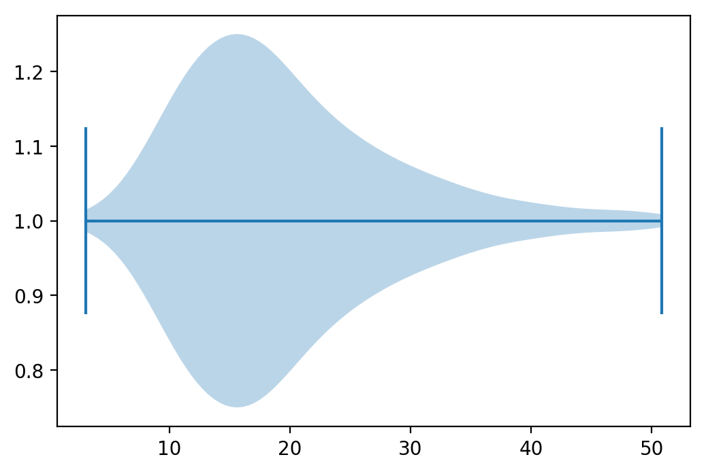
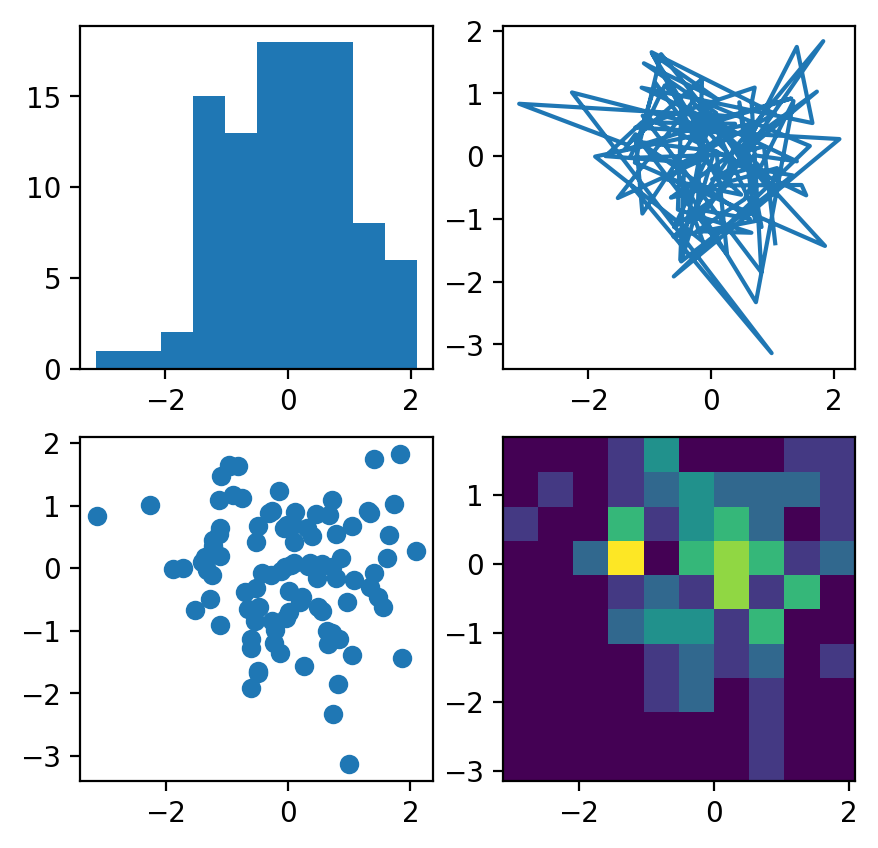

Hey3, This blog started mostly as an archive for R-related things as I was starting
to use R as my main tool / language for data analysis. For a while, I've been
also using Python. Looking for a literate programming alterative in Python
I found [Pweave](http://mpastell.com/pweave). So I'd like to also use this blog
as an archive for Python-related things, starting with how to use PWeave to
write blog posts. Yeah, I guess I can keep using RMarkdown to write
Python-related blog posts, but I find Python support still limited and
therefore I prefer to write the posts in the main editor I use to write python
code (currently Atom).

# PWeave

Using PWeave you can write using several formats and then compile the notebook
into, also, several formats (e.g. markdown, html). It seems it was inspired by
Sweave, which was the most common literate programming approach for R users
before RmarkDown came to the scene.

I would use either the pmd format (markdown + python code chuncks) or simply
python scripts, compiled into a notebook using PWeave (similar to knitr's spin).

# Blogdown integration

If you are not using a different container for images, in `blogdown` they are
located in the `static/post` directory that is then published as `/post` by
netlify. So tipically an image is referenced from html or markdown
files as `/post/post_dir/figure-html/x.png`

PWeave on the other hand by default generates images in the `./images`
directory.

So, to get it to work, you can change the figures directory, for example,
using the [command line args](http://mpastell.com/pweave/script.html).

Assuming the post .pmd source file is located in the standard directory
`content/post` and considering the imagens need to be in
the `static/post` directory, let's change it to that. That way, the
figures will be generated in the correct location and you just need to add the
files and push the changes to the repository for netlify to process the changes.

However, you need to change the generated markdown file, to
amend the location of the figures. Changing it from the relative path
(`../../post`) to the absolute path (`/post`), since that will be the location
in netlify. Alternatively, realizing that netlify arranges the file by
year/month/post_title/index.html you could try to fix the reference also to
a relative path. But that seems like a silly option in comparison, and
error-prone in case the date is not available or who knows.

[//]: cd "D:\\MEGA\\R\\blog\\content\\post"
[//]: pweave -f markdown 2017-11-01_Publishing_From_PWeave.pmd --figure-directory=../../static/post/2017-11-01_Publishing_From_PWeave
[//]: pweave -f html 2017-11-01_Publishing_From_PWeave.pmd --figure-directory=../../static/post/2017-11-01_Publishing_From_PWeave
[//]: pweave -f md2html 2017-11-01_Publishing_From_PWeave.pmd --figure-directory=../../static/post/2017-11-01_Publishing_From_PWeave
[//]: sed -i 's+../../static++g' .\2017-11-01_Publishing_From_PWeave.md

# PWeave supported features

## Matplotlib plots

It supports `matplotlib` plots.


```python
# Import the necessary libraries
import matplotlib.pyplot as plt
import pandas as pd

# Initialize Figure and Axes object
fig, ax = plt.subplots()

# Load in data
tips = pd.read_csv("https://raw.githubusercontent.com/mwaskom/seaborn-data/master/tips.csv")

# Create violinplot
ax.violinplot(tips["total_bill"], vert=False)

# Show the plot
plt.show()
```

\


```python
# And this from the official matplotlib examples
# https://matplotlib.org/3.1.1/tutorials/introductory/sample_plots.html

import matplotlib.pyplot as plt
import numpy as np

np.random.seed(19680801)
data = np.random.randn(2, 100)

fig, axs = plt.subplots(2, 2, figsize=(5, 5))
axs[0, 0].hist(data[0])
axs[1, 0].scatter(data[0], data[1])
axs[0, 1].plot(data[0], data[1])
axs[1, 1].hist2d(data[0], data[1])

plt.show()
```

\


## Mathjax

Easy way

<p><span class="math inline">\(y=x^2\)</span></p>

The Hamming window:
$w(n) = \alpha - \beta\cos\frac{2\pi n}{N-1}$, where $\alpha=0.54$ and $\beta=0.46$
